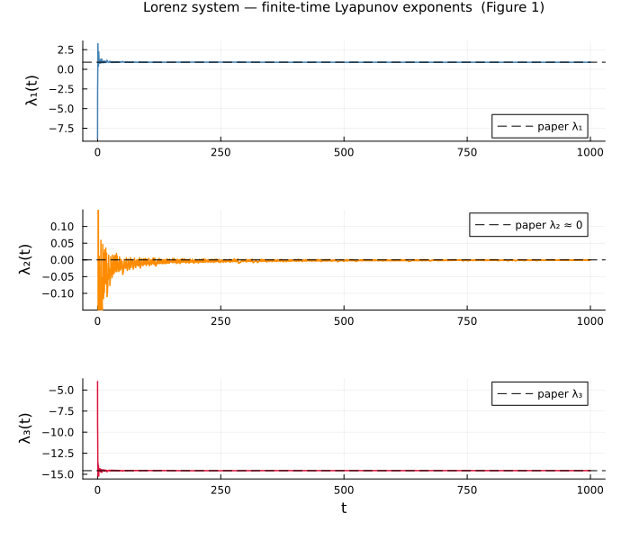

# LyapunovSpectra.jl

A Julia implementation of the continuous Gram–Schmidt orthonormalization
method for computing Lyapunov spectra associated with a dynamical system
specified by a set of differential equations, based on:

> F. Christiansen and H. H. Rugh,
> *"Computing Lyapunov spectra with continuous Gram–Schmidt orthonormalization"*
> Nonlinearity **10**, 1063–1072 (1997)

---

## Mathematical background

Given a dynamical system $`\dot{x} = v(x)`$ in $`\mathbb{R}^d`$, the Lyapunov spectrum
$`\{\lambda_1 \geq \lambda_2 \geq \dots \geq \lambda_k\}`$ describes the exponential
growth rates of infinitesimal perturbations along a trajectory.

The method augments the original system with an orthonormal $`k`$-frame
$`E = \{e_1, \dots, e_k\}`$ and a Lyapunov accumulator vector $`\Lambda`$:

```math
\dot{x} = v(x)
```
```math
\dot{e}_m = J e_m - \sum_{l \leq m} e_l L_{lm}, \qquad m = 1, \dots, k
```
```math
\dot{\Lambda}_m = J_{mm}, \qquad m = 1, \dots, k
```

where $`J = \partial v / \partial x`$ is the Jacobian, $`J_{mm} = (e_m, J e_m)`$, and $`L_{lm}`$ are stabilized matrix elements:

```math
L_{mm} = J_{mm} + \beta\left((e_m, e_m) - 1\right)
```
```math
L_{lm} = J_{lm} + J_{ml} + 2\beta(e_l, e_m), \qquad l < m
```

The parameter $`\beta > 0`$ acts as a restoring force that continuously corrects
any drift from orthonormality. The Lyapunov exponents are recovered as:

```math
\lambda_m = \lim_{t \to \infty} \frac{\Lambda_m(t)}{t}
```

The method is proven strongly stable when $`\beta > -\lambda_k`$ (Theorem, p.1065).

---

## Repository structure

```
LyapunovSpectra.jl/
├── src/
│   ├── LyapunovSpectra.jl   # Module entry point
│   ├── algorithm.jl         # Core CGS augmented ODE (eq. 6)
│   ├── systems.jl           # Built-in example systems
│   └── solver.jl            # ODE wrapper and statistics
├── examples/
│   ├── lorenz.jl            # Step-by-step walkthrough — Lorenz system
│   └── hamiltonian.jl       # Quartic Hamiltonian system
├── test/
│   └── runtests.jl          # Automated test suite (algorithm + examples)
│   ├── test_algorithm.jl    # Tests for algorithm implementation
│   ├── test_examples.jl     # Specific test for the examples
└── Project.toml
```

---

## Installation

Clone the repository and instantiate the environment:

```bash
git clone https://github.com/jpatinoe/LyapunovSpectra.jl.git
cd LyapunovSpectra.jl
julia --project=. -e 'using Pkg; Pkg.instantiate()'
```

The examples also require `Plots.jl`:

```bash
julia --project=. -e 'using Pkg; Pkg.add("Plots")'
```

---

## Walkthrough: Lorenz system

`examples/lorenz.jl` is a self-contained step-by-step example that reproduces
Figure 1 and Table 1 of the paper. Here is what each step does and why.

### Step 1 — Define the system

Provide two in-place functions: the vector field and its Jacobian.

```julia
using LyapunovSpectra

function my_v!(du, u)
    du[1] = 10.0*(u[2] - u[1])
    du[2] = 28.0*u[1] - u[2] - u[1]*u[3]
    du[3] = u[1]*u[2] - (8.0/3.0)*u[3]
end

function my_J!(Jmat, u)
    Jmat[1,1] = -10.0;         Jmat[1,2] =  10.0; Jmat[1,3] =  0.0
    Jmat[2,1] =  28.0 - u[3]; Jmat[2,2] =  -1.0; Jmat[2,3] = -u[1]
    Jmat[3,1] =  u[2];         Jmat[3,2] =  u[1]; Jmat[3,3] = -8.0/3.0
end

prob = LyapunovProblem(my_v!, my_J!, 3, 3, 20.0)
#                                    d  k   β
```

The `LyapunovProblem` struct packages the system definition together with
the dimension $`d`$, the number of exponents to compute $`k`$, and the
stability parameter $`\beta`$. For the Lorenz system, $`\beta = 20`$ as
chosen in the paper (section 3).

Alternatively, use the built-in constructor:

```julia
prob = lorenz_system()   # d=3, k=3, β=20
```

### Step 2 — Warm-up integration

Starting from an arbitrary initial condition, we first integrate the system
for a short time to land on the attractor before measuring. This eliminates
the transient visible at small $`t`$ in the figure below.

```julia
using OrdinaryDiffEq

prob_warmup = LyapunovProblem(prob.v, prob.J, prob.d, 1, prob.β)
u0_warmup   = make_initial_state(prob_warmup, [1.0, 0.0, 0.0])
warmup_sol  = solve(ODEProblem(build_ode!(prob_warmup), u0_warmup,
                               (0.0, 50.0), nothing), Tsit5();
                    save_everystep=false)

x0 = warmup_sol.u[end][1:3]   # trajectory part of the augmented state
```

We use $`k = 1`$ for the warm-up (only the trajectory is evolved, no frame)
so it is cheap. The warm-up time of $`T = 50`$ is enough for the Lorenz
system to reach its attractor from almost any starting point.

### Step 3 — Compute the Lyapunov exponents

```julia
λ = lyapunov_exponents(prob, x0, 1000.0)
# λ ≈ [+0.906, 0.000, -14.572]
```

Internally, `lyapunov_exponents` does three things:

1. Calls `make_initial_state` to build the full augmented state vector
   $`u_0 = [x_0;\ \text{vec}(E_0);\ 0_k]`$ of length $`d + dk + k = 15`$
2. Calls `build_ode!` to assemble the augmented ODE system (eq. 6 of the paper)
3. Integrates with `Tsit5()` (a modern Runge-Kutta 4/5 solver) and
   returns $`\Lambda(T)/T`$

### Step 4 — Interpret the results

The three exponents describe the Lorenz attractor:

| Exponent | Value | Meaning |
|---|---|---|
| $`\lambda_1 \approx +0.906`$ | positive | trajectories separate exponentially → the system is **chaotic** |
| $`\lambda_2 \approx 0`$ | zero | neutral direction along the flow |
| $`\lambda_3 \approx -14.57`$ | strongly negative | rapid contraction — the attractor is thin |

The sum $`\lambda_1 + \lambda_2 + \lambda_3 = -\sigma - 1 - b = -13.6\overline{6}`$
is an exact analytical result (trace of the Jacobian) and serves as a
validation that the algorithm is working correctly.

### Step 5 — Convergence plot

Running with `save_everystep=true` gives access to $`\Lambda_m(t)/t`$ at
every time step, showing how the finite-time exponents converge as $`t \to \infty`$:



The spike at small $`t`$ is a transient from the initial frame — it decays
quickly and all three exponents converge to their asymptotic values well
before $`t = 500`$. The dashed lines show the paper's reference values.

### Step 6 — Statistics over many runs

```julia
x0_list = [randn(3) .+ x0 for _ in 1:1000]
λ_mean, λ_std = lyapunov_exponents_mean(prob, x0_list, 1000.0)
```

This reproduces Table 1 of the paper. For an ergodic system the exponents
are independent of the initial condition (Oseledec theorem), so averaging
over many runs reduces the finite-time variance.

---

## General usage

### Defining your own system

```julia
push!(LOAD_PATH, ".")
using LyapunovSpectra

function my_v!(du, u)
    # write ẋ = v(x) into du
end

function my_J!(Jmat, u)
    # write ∂v/∂x into Jmat
end

prob = LyapunovProblem(my_v!, my_J!, d, k, β)
λ    = lyapunov_exponents(prob, x0, T)
```

### Choosing $`\beta`$

The stability parameter $`\beta`$ must satisfy $`\beta > -\lambda_k`$, where
$`\lambda_k`$ is the smallest exponent you want to compute. In practice:

1. Start with $`\beta = 1.0`$
2. Run a short trial integration
3. If orthonormality drifts ($`\|E^\top E - I\|`$ grows), increase $`\beta`$
4. Do not set $`\beta`$ too large — it increases the stiffness of the augmented system

Values used in the paper: $`\beta = 20`$ (Lorenz), $`\beta = 0.5`$ (Hamiltonian).

---

## Running the examples

```bash
# Lorenz system — step-by-step walkthrough, reproduces Figure 1 and Table 1
julia --project=. examples/lorenz.jl

# Quartic Hamiltonian — reproduces Figure 2 and Table 2
julia --project=. examples/hamiltonian.jl
```

Both scripts save a convergence plot (`.png`) in the project root.

---

## Running the tests

```bash
julia --project=. test/runtests.jl
```

The test suite is split into two parts:

**Generic algorithm tests** (`test/test_algorithm.jl`) — these check mathematical
properties that must hold for any correct implementation of the method,
regardless of which system is used:

| Test | Property | Why it must hold |
|------|-----------|-----------------|
| A1 | Exponents in descending order | Structural property of Gram-Schmidt ordering |
| A2 | Partial spectrum (k=1) consistent with full | Largest exponent unaffected by reducing k |
| A3 | Frame orthonormality `‖E'E − I‖ < 1e-6` | β stabilisation term in eq. (6) |
| A4 | Sum of exponents = tr(J) | Liouville's theorem |
| A5 | Symplectic pairing `λₖ + λ_{d+1−k} = 0` | Hamiltonian structure of the flow |

**Example-specific tests** (`test/test_examples.jl`) — these check known
qualitative facts about the two systems from the paper. They are tied to
specific parameter choices and initial conditions:

| Test | System | Property |
|------|--------|----------|
| E1 | Lorenz | λ₁ > 0 (system is chaotic) |
| E2 | Lorenz | λ₂ ≈ 0 (neutral direction along the flow) |
| E3 | Lorenz | λ₁ within 0.05 of paper value (0.9057) |
| E4 | Hamiltonian | λ₁ > 0 (system is chaotic at this energy) |
| E5 | Hamiltonian | Three positive and three negative exponents |
| E6 | Hamiltonian | Positive exponents in expected range |

If A-tests fail, the algorithm implementation is broken. If E-tests fail,
the example systems or their parameters may need adjusting.

---

## Validation

Two analytical constraints validate the algorithm independently of
the paper's numerical values:

**Lorenz** — the sum of all exponents equals the trace of the Jacobian
averaged over the attractor:

```math
\lambda_1 + \lambda_2 + \lambda_3 = -\sigma - 1 - b = -13.6\overline{6}
```

**Hamiltonian** — symplectic structure forces exponents to come in conjugate pairs:

```math
\lambda_k + \lambda_{d+1-k} = 0 \qquad \text{for all } k
```

Both constraints are satisfied to $`< 10^{-4}`$ in our implementation.

---

## Dependencies

| Package | Role |
|---|---|
| `OrdinaryDiffEq` | ODE integration (`Tsit5`, `ODEProblem`, `solve`) |
| `LinearAlgebra` | `dot`, `norm`, `mul!` |
| `Statistics` | `mean`, `std` over runs |
| `Printf` | Formatted output in examples |
| `Plots` | Convergence figures in examples |

---

## Reference

Christiansen, F. and Rugh, H. H. (1997).
*Computing Lyapunov spectra with continuous Gram–Schmidt orthonormalization.*
Nonlinearity, 10(5), 1063–1072.
